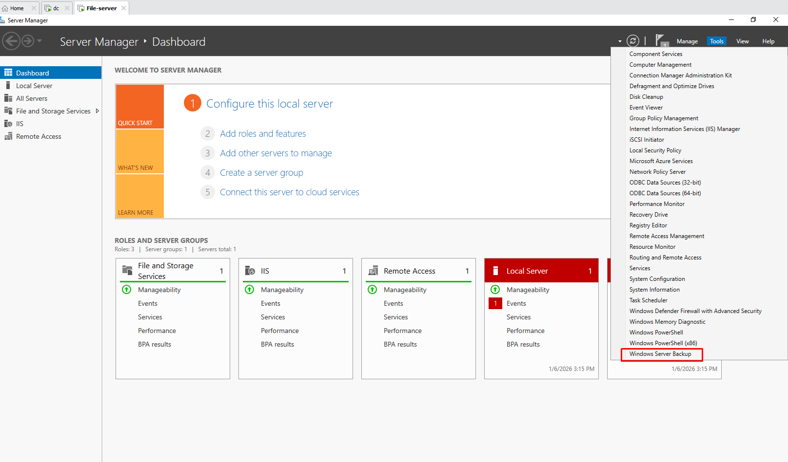
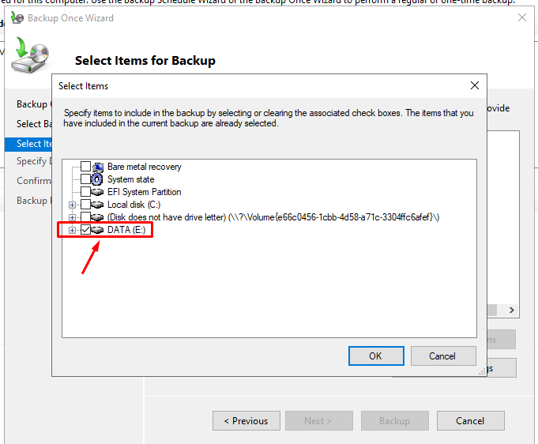
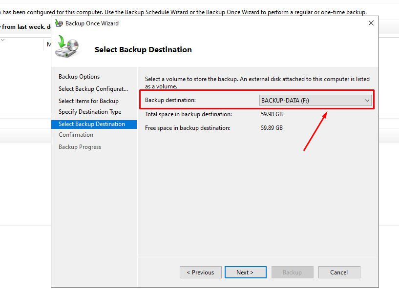
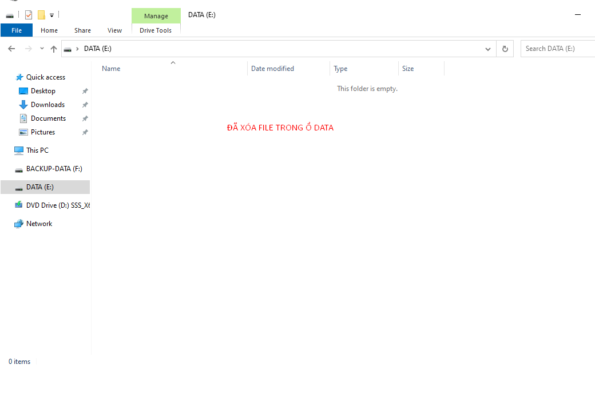
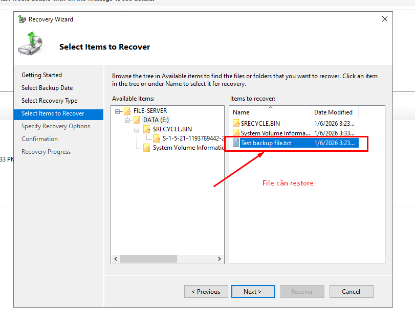
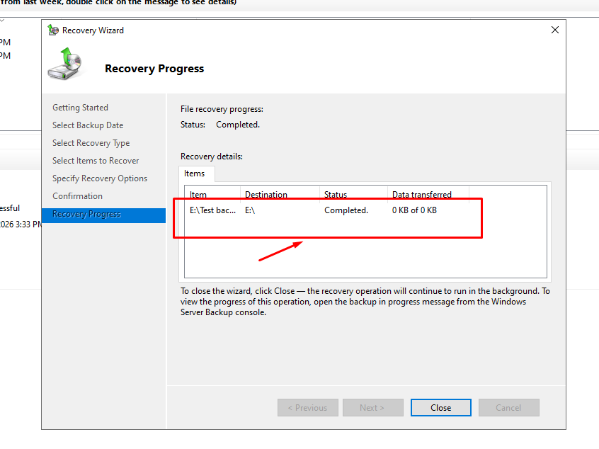
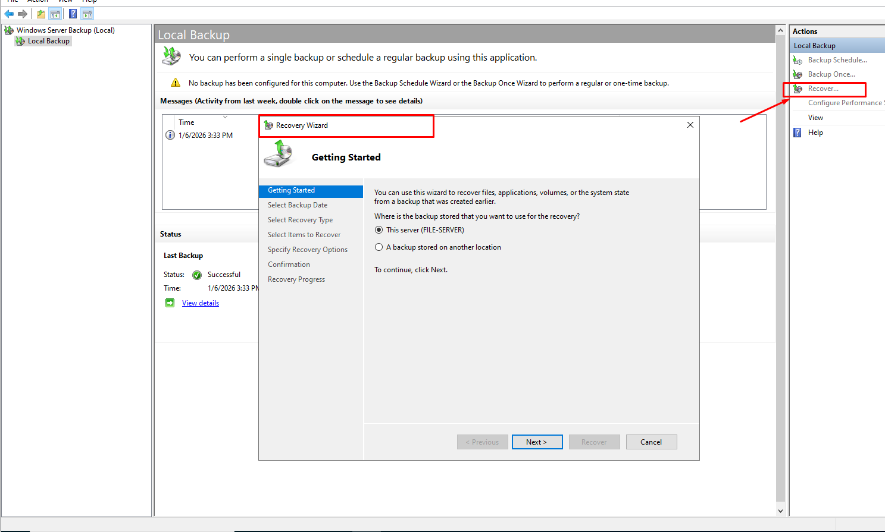
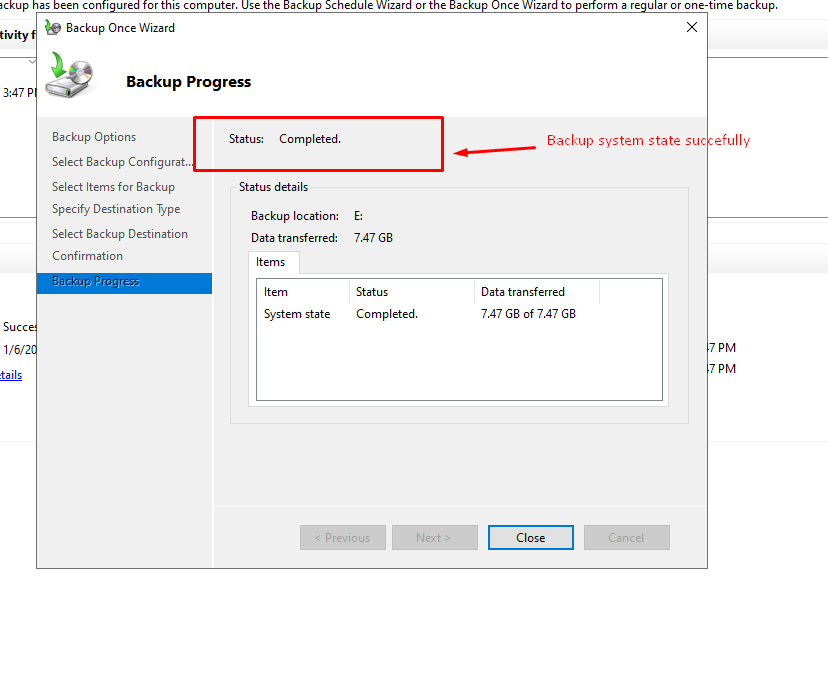

# Tuần 5 – Backup & Disaster Recovery (Windows Server)

## 🎯 Mục tiêu
Triển khai giải pháp Backup và Disaster Recovery cho hệ thống Windows Server,
đảm bảo dữ liệu và Active Directory có thể khôi phục khi xảy ra sự cố như
xóa nhầm file hoặc lỗi Domain Controller.

---

## 🧱 Mô hình lab
- Domain: thatccna.isa  
- Domain Controller: 192.168.189.10  
- File Server: 192.168.189.20  
- Công cụ backup: Windows Server Backup  

---

## 🔹 Phần 1 – Backup File Server

### 1. Cài đặt Windows Server Backup
- Cài feature **Windows Server Backup** thông qua Server Manager  
- Mở công cụ từ Server Manager → Tools → Windows Server Backup  

📸 Minh họa:  

---

### 2. Thực hiện Backup dữ liệu File Server
- Chọn **Backup Once**
- Backup option: **Different options**
- Backup configuration: **Custom**
- Chọn thư mục/ổ đĩa chứa dữ liệu người dùng
- Lưu backup vào **ổ đĩa khác ổ dữ liệu (Destination)**

📸 Minh họa:  
  
  
  
  

---

## 🔹 Phần 2 – Restore File  
*(Giả lập user xóa nhầm file TXT trong thư mục DATA)*

### 3. Giả lập sự cố mất dữ liệu
- Xóa một file TXT trong thư mục `E:\DATA` trên File Server

📸 Minh họa:  

---

### 4. Restore file từ bản backup
- Mở **Windows Server Backup**
- Chọn **Recover**
- Restore type: **Files and folders**
- Chọn thời điểm backup gần nhất
- Restore file về **Original location**

📸 Minh họa:  
  

---
## 🔹 Phần 3 – Backup Domain Controller (System State)

### 5. Backup System State trên Domain Controller
- Thực hiện **Backup Once** với chế độ **Custom**
- Chọn **System State**
- Lưu backup vào ổ đĩa riêng

📸 Minh họa:  
  
  

---
- **System State** bao gồm: Active Directory, DNS, SYSVOL, Registry  
- Khi Active Directory gặp sự cố nghiêm trọng, cần **restore System State**  
- Áp dụng nguyên tắc backup **3–2–1**:
  - 3 bản backup  
  - 2 thiết bị lưu trữ khác nhau  
  - 1 bản backup lưu ngoài hệ thống  
---
## ✅ Kết quả đạt được
- Backup thành công dữ liệu File Server  
- Restore được file khi user xóa nhầm  
- Backup được System State Domain Controller  
- Hệ thống sẵn sàng phục hồi khi xảy ra sự cố  
